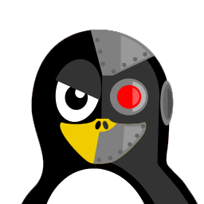

:Nom:           Epsius-Discord-Bot
:Logo:          
:Info-Bar:      https://github.com/louis-ducruet/Epsius-Discord-Bot/blob/main/package.json[image:https://img.shields.io/github/package-json/v/louis-ducruet/Epsius-Discord-Bot?style=for-the-badge[Badge de version]] \ 
https://github.com/louis-ducruet/Epsius-Discord-Bot/blob/main/LICENSE[image:https://img.shields.io/github/license/louis-ducruet/Epsius-Discord-Bot?style=for-the-badge[Badge de liscence]] \
https://github.com/louis-ducruet/Epsius-Discord-Bot/graphs/contributors[image:https://img.shields.io/github/contributors/louis-ducruet/Epsius-Discord-Bot.svg?style=for-the-badge[Badge de contributeur]] \
https://github.com/louis-ducruet/Epsius-Discord-Bot/issues[image:https://img.shields.io/github/issues/louis-ducruet/Epsius-Discord-Bot?style=for-the-badge[Bage d'issues]] \
https://github.com/louis-ducruet/Epsius-Discord-Bot/commits/main[image:https://img.shields.io/github/last-commit/louis-ducruet/Epsius-Discord-Bot?style=for-the-badge[Badge du dernier commit]]
